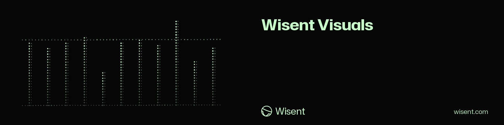

<!-- wisent-banner:start -->
<p align="center">
  
</p>
<!-- wisent-banner:end -->

<!-- wisent-readme-signals:start -->
[](https://github.com/wisent-ai/wisent-visuals) [](https://github.com/wisent-ai/wisent-visuals/issues) [](https://wisent.com) [](https://discord.gg/qRjpkthq54) [](https://www.linkedin.com/company/wisent-ai/) [](https://x.com/wisentai) [](https://calendly.com/lbartoszcze)
<!-- wisent-readme-signals:end -->

# Wisent Visuals

Charts That Already Look Like Your Company.

Every deck ends the same way: someone re-colours a matplotlib default at midnight
so the chart does not look like a lab report. Wisent Visuals gives you the chart
types you actually use, already carrying the brand — colours, type, spacing and
the small decisions nobody wants to make twice. Describe one chart and get a
figure you can put in front of a customer. Your plots stop being the weakest
slide in the room.

Brand-Ready Plots, One Command Away.

## What it is

A Rust crate with three commands:

- `wisent-chart` draws an area, bar, column, line, pie, radar or bubble chart
  from a JSON spec, as SVG or PNG.
- `wisent-banner` renders one README banner from a TOML file.
- `wisent-banner-bot` keeps every organization repository's banner and buttons
  current.

Banners are described in [README banners](docs/readme-banners.md); charts in
[Charts](docs/charts.md).

## Installation

```bash
git clone https://github.com/wisent-ai/wisent-visuals
cd wisent-visuals
cargo install --path .
```

## Quick start

```bash
wisent-chart --spec chart.json --output chart.png
```

with `chart.json`:

```json
{"kind": "column", "style": "solid", "theme": "brand", "width": 1002, "height": 499,
 "categories": ["Q1", "Q2", "Q3"], "series": [[800, 550, 1000], [500, 250, 750]],
 "labels": ["One", "Two"], "title": "Group Column Chart"}
```

`--spec -` reads the spec from standard input. The output's suffix picks the
format: `.svg` writes the SVG, `.png` rasterises it with the bundled Hubot Sans.

## Development

`cargo test` runs the banner renderer and the banner bot through their real
binaries. Brand colours, the typeface and the logo live in `src/brand.rs` and
`assets/`; the chart families in `src/chart/`.

## Releases

A release is the crate's source bundle, versioned by `Cargo.toml`
(`.wisent-release.json`). The Python package `wisent-visuals` on PyPI was
replaced by this crate; its last published version stays installable but is no
longer updated.

## License

MIT License - see LICENSE file for details.
